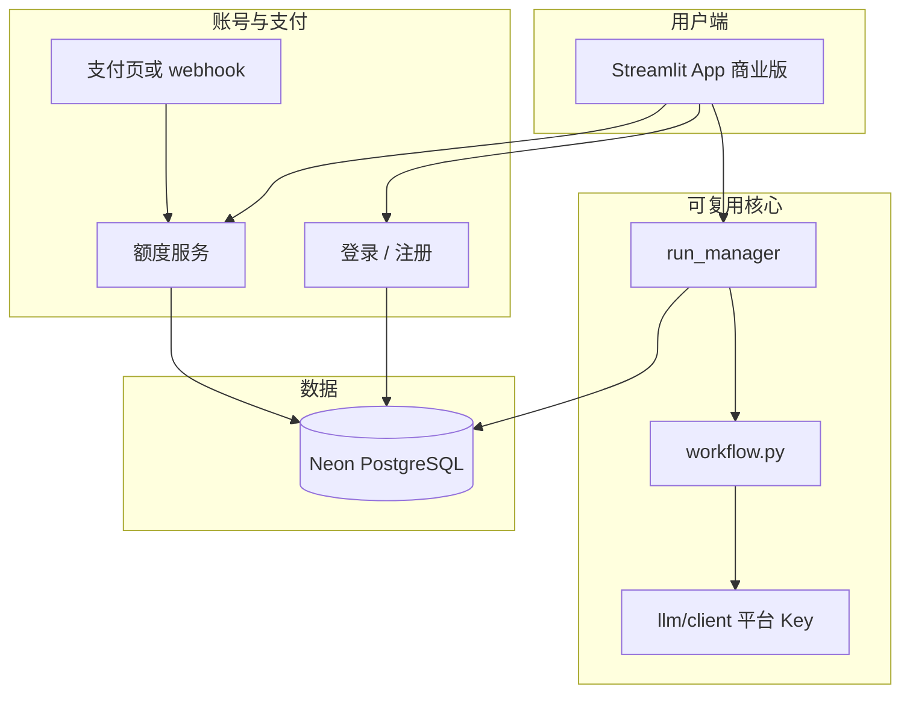

# 对外收费版：从教研内部版复制与改造指南

本文说明如何**保留当前仓库作教研组内部使用**，再**复制一版**改造成对外收费产品。不涉及法律意见；上线前请自行确认资质、用户协议与数据合规。

---

## 1. 建议的总体策略

| 版本 | 用途 | 仓库建议 |
|------|------|----------|
| **内部版**（当前） | 教研组备课、共用管理员、可自带 Key | 保持现有私有仓库，不再对外分发 |
| **商业版**（新） | 对外收费、独立品牌与计费 | **新仓库**或新目录 + 独立 Streamlit Cloud 应用 |

**不要**在同一个公开仓库里同时放内部 Secrets 习惯与收费逻辑；商业版单独部署、单独 Neon 库、单独域名。

复制方式（任选）：

```bash
# 方式 A：GitHub 上 Duplicate repository → 新仓 commercial-xxx（推荐）
# 方式 B：本地复制目录后 git init
xcopy /E /I "应用文project" "应用文project-commercial"
cd 应用文project-commercial
git init
git remote add origin <新仓库 URL>
```

复制后第一件事：改 `UI_BUILD_TAG`、应用标题、`README`，并**删除/勿带入**任何真实 `.env`、管理员口令、API Key。

---

## 2. 内部版 vs 商业版：差异对照

| 维度 | 内部版（现状） | 商业版（建议） |
|------|----------------|----------------|
| **用户身份** | 匿名 `guest_id`（换浏览器即新用户） | 注册登录（邮箱/手机/微信）或「兑换码 + 设备绑定」 |
| **API Key** | 用户在侧边栏自填（BYOK） | **平台统一 Key**（用户不接触 Key）或「高级版 BYOK」 |
| **历史数据** | 按 guest 隔离，管理员口令看全部 | 按 **user_id** 隔离；运营后台查单用户 |
| **管理员** | 侧边栏 `ADMIN_PASSWORD` | 独立运营后台或 Supabase/Retool，**不要**用单一明文口令 |
| **收费** | 无 | 订阅/按次/套餐（见下文） |
| **用量限制** | 无 | 每日 Stage 次数、全流程次数、并发上限 |
| **品牌** | 教研内部名称 | 对外产品名、Logo、用户协议/隐私政策 |
| **Prompt** | 可随意改 | 建议锁定或仅运营可改，避免用户侧泄露教研资产 |
| **文档** | `NEON_SETUP`、`LLM_CACHE` 等 | 用户帮助中心；技术文档不公开 |

**可原样复用（约 70% 代码）**

- `workflow.py`、`prompts/`、`utils/parsers.py`、`llm/client.py`（若改为平台 Key）
- `ui/run_manager.py` 线程/流式/分阶段逻辑
- `db` 双后端模式、`upsert` 历史、`llm_cache` 降本
- Word 导出、图片识题（若对外提供）

**必须改或新增**

- 身份与计费层（见第 3、4 节）
- 侧边栏：隐藏「自填 Key」或仅 VIP 可见
- 未付费 / 额度用尽时的拦截与引导支付
- 删除或禁用「管理员 Popover 看全部历史」（改运营系统）

---

## 3. 收费模式怎么选（先定商业规则再写代码）

### 方案 A：平台代调用（最常见）

- 你在 Secrets 里配置各厂商 Key，用户**只付你**。
- 优点：体验简单；可精确控成本与定价。
- 缺点：你要承担 token 账单与滥用风险；需**用量封顶**。

配套实现：用户表 + `quota_remaining`；每次 `try_start_run_job` 前扣减；超额弹窗「购买套餐」。

### 方案 B：用户自带 Key（BYOK）+ 收软件费

- 与现内部版类似，收费的是「工具使用权」。
- 优点：你不垫 API 费用。
- 缺点：对外用户配置门槛高；售后问题多（Key 无效、模型名错误）。

适合：面向机构教师的高级版；可做成「基础版平台 Key + 专业版 BYOK」。

### 方案 C：兑换码 / 机构 License

- 学校采购 N 个席位，发码激活；适合 B2B。
- 实现：表 `licenses(code, expires_at, max_devices)`，登录时校验。

### 支付接入（国内常见）

| 方式 | 适用 |
|------|------|
| 微信支付 / 支付宝（服务商或 Ping++、虎皮椒等） | C 端个人付费 |
| 爱发电 / 小报童 | 轻量会员，接入快 |
| Stripe | 海外用户 |
| 对公合同 + 人工开码 | 学校/机构 |

Streamlit 本身无支付组件，通常：**支付在独立 H5/官网完成 → 回调写数据库 → 用户回到 App 刷新额度**。

---

## 4. 推荐技术改造顺序

### 阶段 0：复制与清理（1 天）

- [ ] 新仓库、新 Streamlit App、新 Neon 项目
- [ ] 添加 `LICENSE`（内部版可标「教研组专有」，商业版用你的产品许可）
- [ ] 检查 `.gitignore` 含 `.env`、`history.db`、`logs/`
- [ ] 全局替换产品名、页脚、联系邮箱
- [ ] 移除或改写 `docs/NEON_SETUP.md` 中「管理员口令」对外不适用段落

### 阶段 1：身份体系（3–5 天）

将 `db/identity.py` 中的 `guest_id` 升级为：

```text
users(id, email/phone, password_hash, plan, quota, created_at)
sessions(session_token)  # 或直接用 Streamlit-Authenticator / Supabase Auth
```

历史表 `history.owner_id` 改为 **登录用户 id**（不要再仅用 UUID cookie）。

可选捷径：**[Streamlit-Authenticator](https://github.com/mkhorasani/Streamlit-Authenticator)** 或 **Supabase Auth**（邮箱魔法链接），少写密码逻辑。

### 阶段 2：计费与额度（3–5 天）

- 表 `subscriptions(user_id, plan, expires_at)` 或 `orders`
- 在 `try_start_run_job` / `auto_save_history` 前调用 `check_quota(user)`
- 侧边栏展示：剩余次数 / 到期日
- 支付 webhook 写库增加额度

### 阶段 3：产品化体验（2–3 天）

- 默认**关闭**侧边栏自填 Key（`FEATURE_BYOK=false`）
- 平台 Key 仅从 Secrets 读取；`build_settings` 不再要求用户输入
- 新用户引导：示例题、一键体验（消耗试用次数）
- 用户协议 / 隐私政策勾选（首次登录）

### 阶段 4：运营与安全（持续）

- 速率限制（按 IP + user_id）
- 敏感词/题目长度限制（防刷 API）
- 日志脱敏（不记完整 API Key）
- 成本看板：按日统计 token（已有 `llm_run_usage` 可入库）

---

## 5. 架构示意（商业版）



---

## 6. 从本仓库复制时的「必改文件」清单

| 文件/目录 | 操作 |
|-----------|------|
| `app.py` | 标题、icon；启动时鉴权门控 |
| `ui/sidebar.py` | 品牌、额度展示；条件隐藏 Key/管理员 |
| `db/identity.py` | 替换为正式用户体系 |
| `utils/config.py` | 平台 Key 策略；`resolve_api_key` 商业逻辑 |
| `docs/PROJECT_OVERVIEW.md` | 对外用户版帮助 |
| `.env.example` | 去掉「用户无需配置的 Key」说明，改为运营项 |
| `streamlit_cloud_secrets.toml.example` | 仅平台 Key + DB + 支付密钥 |

**建议不要复制到商业仓的内容**

- 真实 `.env`、`history.db`、`logs/`
- 内部教研专用 prompt 变体（若涉未公开教研资产）
- 个人 GitHub 用户名、内部管理员口令

---

## 7. 成本与定价参考（运营用）

单次完整四阶段约 **3万～4万 token**（视题目与模型而定，见 `LLM_CACHE.md`）。

定价时需考虑：

- 模型单价（gpt-4o-mini 与 glm-5.1 差很多）
- 并行 Stage2/3 与缓存命中后的实际成本
- 支付通道费率、失败重试、恶意刷接口

建议：**试用 1～2 次全流程 + 付费套餐按「全流程次数」卖**，比按 token 对用户更好理解。

---

## 8. 与「续写 project」等产品线关系

若你还有读后续写等兄弟项目，商业版可采用：

- **同一用户账号 / 额度账户** 打通多 App（统一 `users` 表）
- **各 App 独立仓库**，共享 `lib/` 包（workflow、llm、db 抽成 pip 本地包或 monorepo）

避免每个产品各做一套支付与登录。

---

## 9. 下一步需要你拍板的 3 件事

定稿后即可按阶段 1 开工改代码：

1. **收费形态**：平台代调用（A）还是 BYOK+会员（B）还是机构码（C）？
2. **登录方式**：邮箱密码 / 微信 / 仅兑换码？
3. **部署形态**：继续 Streamlit Cloud，还是后续迁 FastAPI + 前端（更大流量时）？

---

## 10. 相关文档

- 功能说明：[PROJECT_OVERVIEW.md](PROJECT_OVERVIEW.md)
- 云端库：[NEON_SETUP.md](NEON_SETUP.md)
- 缓存降本：[LLM_CACHE.md](LLM_CACHE.md)

---

*内部版仓库保持私有；商业版单独生命周期与发布节奏。*
