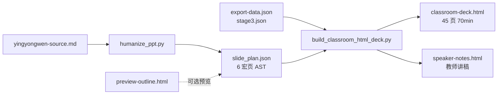

# Plan B：Humanize PPT + 应用文课堂 HTML

> **Plan A（生产）**：`scripts/one_click_classroom_ppt.py` → Architecture V1 + V2 python-pptx → 可编辑 `.pptx`  
> **Plan B（实验）**：Humanize AST → Architecture V1 填槽 → ecc-frontend-slides HTML

Plan B **不替代** Plan A；用于「演讲状态转移 + 浏览器投影 + 讲稿分离」。

## 诚实流水线



| 层 | 谁负责 | 产出 |
|----|--------|------|
| **Humanize** | 观众状态转移（AST） | `slide_plan.json`、`speaker_intent.md`、`preview-outline.html` |
| **Architecture V1** | 页数分配、拆页、全量内容 | 70min 槽位 + Stage1 补充 + Stage3 表 |
| **ecc HTML 渲染** | 投影排版、字体、逐条呈现 | `classroom-deck.html` + `speaker-notes.html` |

Humanize 的 6 页**不是**最终页数；宏页只定义 hook→takeaway 的 **one_thing**，完整审题/PEEL/范文/句型由 Architecture V1 填槽并拆页（≤6 行/页，不缩字号）。

## 一键生成（应用文 export 已就绪）

```powershell
# 1) 若尚无 Humanize AST（可选，已有则跳过）
python C:\Users\Joey\.agents\skills\humanize-ppt\scripts\humanize_ppt.py `
  --source "D:\Downloads\ppt-work\yingyongwen-source.md" `
  --out "D:\Downloads\ppt-work\humanize-run" `
  --title "高考英语应用文 · 心理健康海报选择" `
  --renderer frontend-slides

# 2) Plan B 课堂 HTML（默认 70min）
python scripts/build_classroom_html_deck.py `
  --export "D:\Downloads\ppt-work\export-data.json" `
  --stage3 "D:\Downloads\ppt-work\stage3.json" `
  --slide-plan "D:\Downloads\ppt-work\humanize-run\slide_plan.json" `
  --preset 70min `
  --out "D:\Downloads\ppt-work\humanize-run\classroom-deck.html"
```

产出：

| 文件 | 说明 |
|------|------|
| `humanize-run/classroom-deck.html` | 学生投影（无教师引导/时长） |
| `humanize-run/speaker-notes.html` | 讲稿：观众进/出、本页一件事 |
| `humanize-run/preview-outline.html` | Humanize 状态转移图（渲染前 QA） |

## 课堂使用

1. 浏览器打开 `classroom-deck.html`，**F11** 全屏投影给学生  
2. **空格 / 点击**：逐条呈现要点、表格行（句型/词块）  
3. **← →**：直接翻页（跳过未呈现项）  
4. **S**：打开 `speaker-notes.html` 教师讲稿窗口  

## 排版约定（应用文）

- 正文 **26–32px**，标题 **36–40px**（后排可读）  
- 中文 **Noto Sans SC**，英文例句 **Times New Roman**  
- Stage4 经 `classroom_content_filter` 过滤，学生屏无「教师操作/引导/时长」  

## Humanize 上游 brief

生成 AST 前在源稿参考：`prompts/yingyongwen-humanize-brief.md`（纠正默认「AI 开发者」观众推断）。

## Plan B vs guizang（Plan B+）

| 能力 | Plan B（本脚本） | guizang-ppt-skill |
|------|------------------|-------------------|
| AST / 讲稿分离 | ✅ | ✅（杂志风 HTML + 演讲体检） |
| 70min 全量应用文内容 | ✅ Architecture V1 | 需 brief 填槽 |
| 可编辑 pptx | ❌ | ❌ |
| 配图 / Remotion 媒体槽 | ❌（表格为主） | ✅ slide_plan.media |
| 演讲体检 `--qa-from` | 可对接 Humanize | 原生 |

## 技能路径

| 路径 | 说明 |
|------|------|
| `C:\Users\Joey\.agents\skills\humanize-ppt\` | AST、slide_plan、preview-outline |
| `C:\Users\Joey\.agents\skills\ecc-frontend-slides\` | HTML 渲染规范 |
| `scripts/humanize_classroom_ast.py` | 宏 AST → 每页 metadata |
| `scripts/build_classroom_html_deck.py` | 主入口 |

## 测试

```powershell
pytest tests/test_build_classroom_html_deck.py tests/test_humanize_classroom_ast.py -q
```
